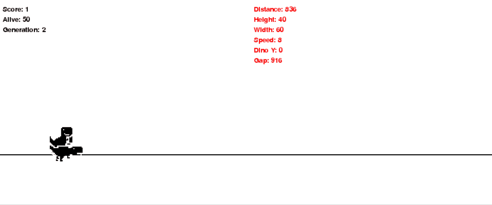

# Google Chrome Dino with NEAT
Implementation of Google Chrome Dino game in Python with pygame.

## Installation
After cloning repo to install required packages type command:
```
python setup.py install
```
It's a good idea to do this in a virtual environment.
Then to run the applications run:
```
python run.py
```

## Preview

